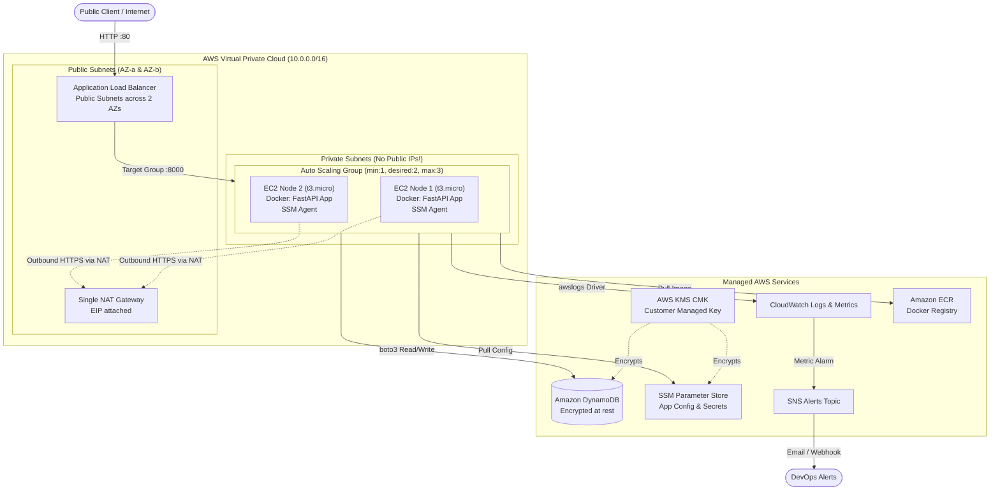

# Compie DevOps Home Assignment

> **Production-Grade Microservice Infrastructure on AWS**  
> Built with Terraform (Modular), Docker, Python FastAPI, DynamoDB, AWS KMS, CloudWatch, and GitHub Actions (OIDC).

---

## 📑 Table of Contents
1. [Architecture Overview](#-architecture-overview)
2. [Security & Well-Architected Principles](#-security--well-architected-principles)
3. [Project Directory Layout](#-project-directory-layout)
4. [Step-by-Step Deployment Guide](#-step-by-step-deployment-guide)
5. [CI/CD Pipeline with AWS OIDC](#-cicd-pipeline-with-aws-oidc)
6. [Capacity Management & Scaling Strategy](#-capacity-management--scaling-strategy)
7. [Logging, Monitoring & Observability](#-logging-monitoring--observability)
8. [Bonus Features Implemented](#-bonus-features-implemented)
9. [Teardown & Cost Cleanup](#-teardown--cost-cleanup)

---

## 🏛 Architecture Overview

This project provisions an enterprise-grade, immutable infrastructure stack on AWS conforming strictly to the assessment requirements:
- **No ECS / EKS**: Compute runs directly on EC2 instances managed by an **Auto Scaling Group (ASG)** in **Private Subnets**.
- **Public Ingress**: Application Load Balancer (ALB) distributed across 2 Availability Zones routes public HTTP traffic to the private instances.
- **Data Persistence**: Fully managed **Amazon DynamoDB** table encrypted with a Customer-Managed Key (KMS CMK).
- **Zero-Downtime Rollouts**: Deployments are executed via **ASG Instance Refresh**, guaranteeing zero downtime without manual console interaction.
- **Zero SSH (Port 22)**: Server administration is performed solely via **AWS Systems Manager (SSM) Session Manager**.
- **Cost-Optimized Free Tier**: Features a single NAT Gateway and `t3.micro` nodes to avoid unnecessary billing.



---

## 🔒 Security & Well-Architected Principles

1. **Private Compute**:
   - EC2 instances reside strictly in private subnets with `map_public_ip_on_launch = false`.
   - Security groups allow inbound traffic **only** from the ALB Security Group on port 8000.
2. **Zero SSH Attack Surface**:
   - **Port 22 is completely closed** in all security groups.
   - Remote terminal access is handled via IAM-governed **AWS Systems Manager (SSM) Session Manager**.
3. **Strict IAM Least-Privilege Separation**:
   - **EC2 Instance Profile**: Granted access strictly to ECR image pulling, CloudWatch log streams, DynamoDB table access, and decrypt permissions on the KMS CMK.
   - **CI/CD Role (GitHub Actions)**: Authenticated via **OIDC (AssumeRoleWithWebIdentity)**. Can push images to ECR and trigger ASG Instance Refresh. **Has NO permissions to read DynamoDB or application secrets!**
4. **Encryption at Rest**:
   - DynamoDB table, SSM Parameter Store `SecureString`, and EC2 root EBS volumes (10 GB gp3) are encrypted using a dedicated **Customer-Managed Key (KMS CMK)** with automatic annual rotation.
5. **IMDSv2 Enforced**:
   - Instance metadata service requires token authentication (`http_tokens = "required"`), mitigating SSRF vulnerabilities.

---

## 📂 Project Directory Layout

```text
.
├── .github/
│   └── workflows/
│       └── deploy.yml              # GitHub Actions CI/CD with AWS OIDC & ASG Instance Refresh
├── app/
│   ├── Dockerfile                  # Production multi-stage, non-root Dockerfile
│   ├── main.py                     # FastAPI service with / and deep /health checks
│   ├── requirements.txt            # Python dependencies (fastapi, boto3, uvicorn)
│   └── .dockerignore
├── terraform/
│   ├── environments/
│   │   └── dev/
│   │       ├── main.tf             # Module orchestration
│   │       ├── variables.tf        # Environment variables
│   │       ├── terraform.tfvars    # Environment configurations
│   │       ├── outputs.tf          # Public URLs and resource identifiers
│   │       └── versions.tf         # AWS Provider (~> 5.0) & Terraform constraints
│   └── modules/
│       ├── vpc/                    # 2 Public AZs, 2 Private AZs, IGW, Single NAT GW
│       ├── security/               # Least-privilege SGs (ALB SG, EC2 SG with zero SSH)
│       ├── kms/                    # Customer Managed Key (CMK) and key policy
│       ├── ecr/                    # Container registry with scan-on-push & lifecycle cleanup
│       ├── database/               # DynamoDB table encrypted with KMS CMK
│       ├── ssm/                    # Parameter Store configurations & KMS secrets
│       ├── iam/                    # GitHub OIDC provider, CI/CD role, EC2 instance profile
│       ├── alb/                    # Public ALB, listener, target group with /health check
│       ├── asg/                    # Launch template, UserData script, ASG, CPU scaling policy
│       └── monitoring/             # CloudWatch log group, unhealthy alarm, SNS topic, dashboard
├── docker-compose.yml              # Clean local container verification
├── AI_USAGE.md                     # Detailed record of AI pair-programming (Bonus)
└── README.md                       # Main architecture & operations guide
```

---

## 🚀 Step-by-Step Deployment Guide

### Prerequisites
- [Terraform](https://www.terraform.io/downloads.html) (>= 1.5.0 installed)
- [AWS CLI](https://aws.amazon.com/cli/) configured with an IAM identity capable of creating resources.
- [Git](https://git-scm.com/)

---

### Step 1: Initialize and Apply Terraform

```bash
# 1. Navigate to the dev environment
cd terraform/environments/dev

# 2. Initialize Terraform and download provider modules
terraform init

# 3. Review proposed infrastructure plan
terraform plan

# 4. Provision infrastructure (takes ~3-4 minutes)
terraform apply -auto-approve
```

Upon completion, Terraform will output:
```text
Outputs:
application_public_url = "http://compie-dev-alb-123456789.us-east-1.elb.amazonaws.com"
application_health_url = "http://compie-dev-alb-123456789.us-east-1.elb.amazonaws.com/health"
ecr_repository_url     = "123456789012.dkr.ecr.us-east-1.amazonaws.com/compie-dev-compie-app"
github_actions_role_arn= "arn:aws:iam::123456789012:role/compie-dev-github-actions-role"
```

---

### Step 2: Build and Push the Initial Application Image

To bootstrap the ASG nodes immediately with the application:

```bash
# 1. Login to Amazon ECR
aws ecr get-login-password --region us-east-1 | docker login --username AWS --password-stdin <YOUR_ECR_URL>

# 2. Build and tag the Docker image
docker build -t <YOUR_ECR_URL>:latest ./app

# 3. Push to ECR
docker push <YOUR_ECR_URL>:latest
```

---

### Step 3: Configure GitHub Actions OIDC Secret

1. In your GitHub Repository (`shlomi-sharbet/compie-devops-assigment`), go to:  
   **Settings** > **Secrets and variables** > **Actions** > **New repository secret**.
2. Name: `AWS_OIDC_ROLE_ARN`
3. Value: Paste the `github_actions_role_arn` from Terraform output  
   *(e.g., `arn:aws:iam::123456789012:role/compie-dev-github-actions-role`)*.

---

### Step 4: Verify Live Endpoints

Once the ASG launches instances (1-2 minutes for bootstrap):
```bash
# Test the Root Endpoint (reads/writes to DynamoDB)
curl -i http://<ALB_DNS_NAME>/

# Test the Deep Health Check
curl -i http://<ALB_DNS_NAME>/health
```

Expected HTTP responses:
* **Root (`/`)**: `HTTP 200 OK` with JSON displaying connection status and visit counter:
  ```json
  {
    "status": "online",
    "service": "compie-devops-app",
    "version": "1.0.0",
    "environment": "dev",
    "message": "Welcome to Compie Cloud Solutions DevOps Microservice!",
    "database": {
      "table": "compie-dev-table",
      "status": "connected",
      "total_visits": 1
    }
  }
  ```
* **Health (`/health`)**: `HTTP 200 OK` confirming active DynamoDB reachability:
  ```json
  {
    "status": "healthy",
    "database": {
      "connected": true,
      "table_name": "compie-dev-table",
      "table_status": "ACTIVE"
    }
  }
  ```

---

## 🔄 CI/CD Pipeline with AWS OIDC

The workflow `.github/workflows/deploy.yml` manages continuous delivery:
1. **Lint & Test**: Runs `flake8` static code analysis on the Python codebase.
2. **OIDC Authentication**: Authenticates with AWS via GitHub's short-lived JWT token (`AssumeRoleWithWebIdentity`), obtaining temporary credentials. **Zero permanent access keys are stored in GitHub!**
3. **ECR Push**: Builds the multi-stage Docker image and tags it with both `${{ github.sha }}` and `latest`.
4. **Zero-Downtime Rollout (Instance Refresh)**:
   - Invokes `aws autoscaling start-instance-refresh` with `MinHealthyPercentage=50` and `InstanceWarmup=180`.
   - The ASG terminates old instances one by one only *after* new instances have passed the ALB `/health` checks.
   - The workflow monitors the refresh progression until full rollout completion.

---

## 📈 Capacity Management & Scaling Strategy

As mandated by the assignment guidelines:
> *"In the README, briefly explain how you manage capacity / how you would scale"*

### 1. Baseline Capacity (Sizing)
* **Instance Type**: `t3.micro` (2 vCPUs, 1 GiB RAM). Sufficient for Python ASGI workloads under low-to-medium baseline traffic while fitting inside the AWS Free Tier (750 hours/month).
* **ASG Dimensions**:
  * `min_size = 1`: Guarantees high availability fallback.
  * `desired_capacity = 2`: Maintains active distribution across 2 Availability Zones (`us-east-1a` and `us-east-1b`) to ensure fault tolerance.
  * `max_size = 3`: Upper threshold preventing runaway costs on a student/demo account during traffic surges.

### 2. Dynamic Target-Tracking Policy (Bonus)
* Configured in Terraform via `aws_autoscaling_policy.cpu_target_tracking`.
* **Metric**: `ASGAverageCPUUtilization` maintained at **50%**.
* When traffic increases and average CPU exceeds 50% over a 3-minute evaluation window, the ASG automatically scales out to `max_size = 3`.
* As load subsides, the ASG scales in smoothly back to `desired_capacity = 2`.

### 3. Production Scaling Roadmap (How we would scale in enterprise production)
1. **Multi-Metric Scaling**: Combine CPU target tracking with ALB `RequestCountPerTarget` (e.g. scale out when requests exceed 1,000 req/sec per target).
2. **Predictive Scaling**: For scheduled spikes (e.g. marketing campaigns, business hours), schedule capacity increases ahead of time.
3. **Instance Diversity & Spot Instances**: For high resilience with 70% cost reduction, implement an ASG Mixed Instances Policy combining On-Demand baseline with Spot instances across multiple instance families (`t3.small`, `t3a.small`, `c6g.medium`).

---

## 📊 Logging, Monitoring & Observability

1. **Native Container Logging**:
   - The Docker daemon is configured with the `awslogs` driver, streaming container standard output and error directly to `/compie/dev/app-logs` in CloudWatch.
   - 7-day retention period configured in Terraform to optimize storage costs.
2. **Proactive Alerting**:
   - Metric Alarm `compie-dev-alb-unhealthy-hosts-alarm` monitors `UnHealthyHostCount >= 1` on the ALB target group.
   - Connected to SNS Topic `compie-dev-alerts-topic` with email subscription.
3. **CloudWatch Observability Dashboard (Bonus)**:
   - Includes real-time widgets for:
     1. ALB Total Request Count
     2. Target Group Host Health (Healthy vs. Unhealthy)
     3. Average Target Response Latency
     4. ASG Cluster CPU Utilization

---

## 🎁 Bonus Features Implemented

| Bonus Item | Status | Implementation Details |
| :--- | :---: | :--- |
| **CloudWatch Dashboard** | ✅ | Defined via `aws_cloudwatch_dashboard.main` with 4 custom time-series widgets. |
| **Customer-Managed KMS Key (CMK)** | ✅ | Dedicated KMS key with automatic rotation; encrypts EBS, DynamoDB, and SSM. |
| **Dynamic ASG Scaling Policy** | ✅ | Target-tracking on 50% average CPU utilization. |
| **AI Collaboration Artifact** | ✅ | Comprehensive `AI_USAGE.md` documenting prompts, trade-offs, and methodology. |
| **Zero SSH Attack Surface** | ✅ | Port 22 completely closed; management via AWS SSM Session Manager. |
| **OIDC Authentication** | ✅ | Keyless IAM role federation for GitHub Actions. |

---

## 🧹 Teardown & Cost Cleanup

To prevent ongoing charges on your new AWS account (especially for the NAT Gateway), execute:

```bash
cd terraform/environments/dev
terraform destroy -auto-approve
```

All provisioned AWS resources (VPC, NAT Gateway, Elastic IP, ALB, EC2 ASG, DynamoDB table, SSM parameters, and CloudWatch groups) will be cleanly terminated.
